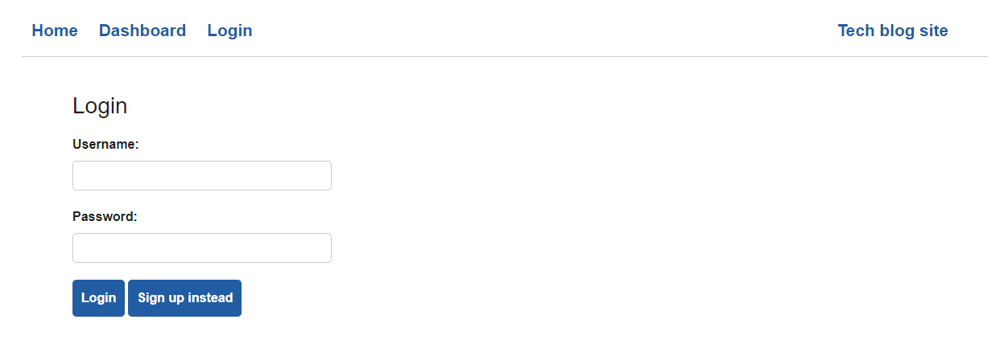
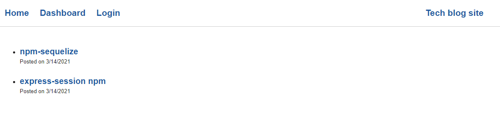
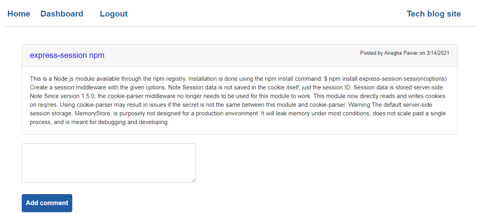
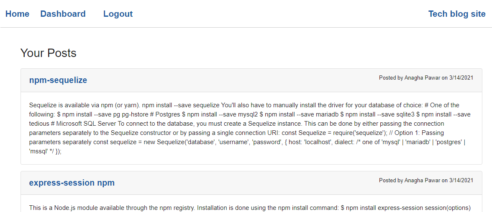
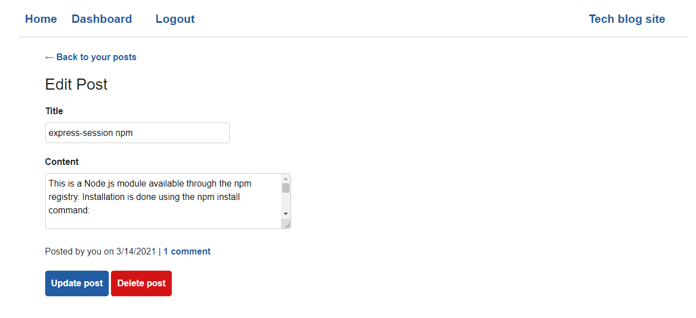

# Tech blog site

## Purpose of application
To build a site similar to a Wordpress site, where developers can publish their blog posts and comment on other developers’ posts as well.

## Description
This is a CMS-style blog site similar to a Wordpress site, where developers can publish their blog posts and comment on other developers’ posts as well. This application follows the MVC paradigm in its architectural structure, using Handlebars.js as the templating language, Sequelize as the ORM, and the express-session npm package for authentication, deployed it to Heroku.
Application flow:
* When user visits the site for the first time presented with the homepage, which includes existing blog posts if any have been posted; navigation links for the homepage and the dashboard; and the option to log in.
* When click on any other links in the navigation then prompted to either sign up or login.
* On sign up, prompted to enter username and password. On click of sign up user has been created and signed in to application.
* On Login, user can enter username and password created during sign up and can log in to the application on next visit.
* Once logged in, user see navigation links for the homepage, the dashboard, and the option to log out.
* Click on Home user will be taken to the homepage and presented with existing blog posts that include the post title and the date created.
* When clicked on existing blog post on home page, user will be presented with the post title, contents, post creator’s username, and date created for that post and have the option to leave a comment.
* When entered a comment and click on the submit button while signed in, the comment is saved and the post is updated to display the comment, the comment creator’s username, and the date created.
* On click of dashboard link in the navigation,user is taken to the dashboard and presented with any blog posts that have already created and the option to add a new blog post
* On click of new post button user can enter Title and contents for the blog and clik of create button post will be saved.
* On click on one of my existing posts in the dashboard user will be able to delete or update my post and taken back to an updated dashboard.
* On click of the logout option in the navigation user will be signed out of the site.
* If user is idle on the page for 10 mins then he will be automatically signed out of application.

## User story
AS A developer who writes about tech
I WANT a CMS-style blog site
SO THAT I can publish articles, blog posts, and my thoughts and opinions

## Acceptance crieteria
GIVEN a CMS-style blog site
WHEN I visit the site for the first time
THEN I am presented with the homepage, which includes existing blog posts if any have been posted; navigation links for the homepage and the dashboard; and the option to log in
WHEN I click on the homepage option
THEN I am taken to the homepage
WHEN I click on any other links in the navigation
THEN I am prompted to either sign up or sign in
WHEN I choose to sign up
THEN I am prompted to create a username and password
WHEN I click on the sign-up button
THEN my user credentials are saved and I am logged into the site
WHEN I revisit the site at a later time and choose to sign in
THEN I am prompted to enter my username and password
WHEN I am signed in to the site
THEN I see navigation links for the homepage, the dashboard, and the option to log out
WHEN I click on the homepage option in the navigation
THEN I am taken to the homepage and presented with existing blog posts that include the post title and the date created
WHEN I click on an existing blog post
THEN I am presented with the post title, contents, post creator’s username, and date created for that post and have the option to leave a comment
WHEN I enter a comment and click on the submit button while signed in
THEN the comment is saved and the post is updated to display the comment, the comment creator’s username, and the date created
WHEN I click on the dashboard option in the navigation
THEN I am taken to the dashboard and presented with any blog posts I have already created and the option to add a new blog post
WHEN I click on the button to add a new blog post
THEN I am prompted to enter both a title and contents for my blog post
WHEN I click on the button to create a new blog post
THEN the title and contents of my post are saved and I am taken back to an updated dashboard with my new blog post
WHEN I click on one of my existing posts in the dashboard
THEN I am able to delete or update my post and taken back to an updated dashboard
WHEN I click on the logout option in the navigation
THEN I am signed out of the site
WHEN I am idle on the page for more than a set time
THEN I am automatically signed out of the site 

## Packages used
Application’s folder structure follows the Model-View-Controller paradigm
* express-handlebars : package to use Handlebars.js for your Views
* Mysql2 and Sequelize :  packages to connect to a MySQL database for your Models, and create an Express.js API for your Controllers.
* dotenv : package to use environment variables, 
* bcrypt : package to hash passwords.
* express-session and connect-session-sequelize : packages to add authentication.

## Mock-Up
The following images demonstrates the application functionality:

### Login page

     

### Home page

     

### Add Comments

     

### Dashboard

     

### Edit Post

     

## Website URL 
https://pacific-sands-72490.herokuapp.com/